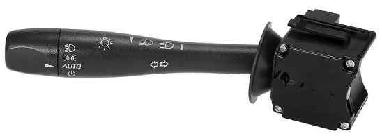
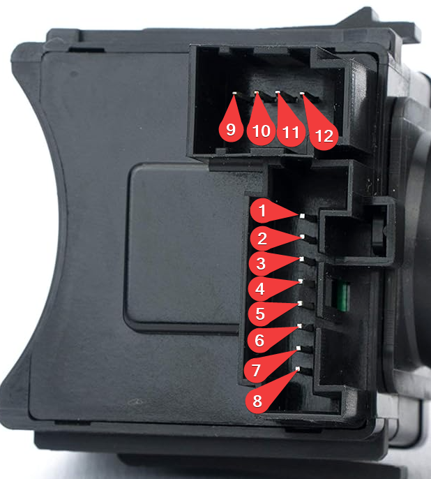

GM Turn Signal Stalk
===============

This project repurposes an authentic automotive turn-signal stalk and transforms it into a fully functional USB gamepad controller.
At its core is an Arduino Leonardo, chosen for its native USB HID capabilities, allowing the device to register as a standard game controller without additional drivers.

Operating Modes

- **Real Mode**
The stalk behaves exactly like in a real vehicle. Each physical detent (left/right signal, neutral, high beam, etc.) is read continuously. The Arduino exposes these states as momentary or held HID buttons, mirroring the mechanical position of the stalk in real time.

- **Game Mode**
Optimized for games that expect digital on/off inputs. Instead of mirroring the physical position, the Arduino triggers a toggle action: each movement of the stalk edge-transitions a virtual button state. This ensures clean, predictable turn-signal behavior even in simulators that lack support for physical latching switches.

Emulating a gamepad with **5** buttons.

## Hardware

- OEM automotive signal stalk (see part description below)
- Arduino Leonardo (ATmega32u4 with native HID support)
- Debounced digital inputs with internal pull-ups
- USB HID Gamepad implementation using Joystick library

## Software

- Joystick library from https://github.com/MHeironimus/ArduinoJoystickLibrary

## Concept

The goal is to recreate the tactile feedback and ergonomics of real automotive controls within a digital environment.
By merging OEM-grade mechanical hardware with microcontroller logic, the project creates an input device that feels unmistakably real — a small echo of the mechanical world carried into the realm of simulation.

## Part description

|||
|---|---|
|Brand|Genuine GM|
|Manufacturer Part Number|20940099|
|Part Description|SWITCH, Headlamp Dimmer|
|Item Dimensions|9.1 x 3.2 x 2.5 inches|
|Item Weight|0.80 Pounds|
|Replaces|10362761, 15258881, 15841544, 15915857|
|Manufacturer|General Motors|
|SKU|20940099|

#### Compatibility list

|Year Make Model|
|---|
|2005-2010 Chevrolet Cobalt|
|2007-2009 Chevrolet Equinox|
|2006-2011 Chevrolet HHR|
|2007-2010 Pontiac G5|
|2005-2006 Pontiac Pursuit|
|2006-2010 Pontiac Solstice|
|2007-2009 Pontiac Torrent|
|2007-2010 Saturn Sky|
|2007-2010 Opel GT|

## Part Diagram - I/O Table

|Pin|Function|
|---|---|
|1 (**Input**)|GND for turn signal|
|2 (**Output**)|Turn signal right|
|3 (**Output**)|Turn signal left|
|4 (**Input**)|GND for high beams|
|5|N/A|
|6 (**Output**)|High beams|
|7 (**Output**)|High beams signal horn|
|8|GND from pin 1 - N/A|
|||
|9 (**Output**)|Signal marker lights|
|10 (**Output**)|Low beams (Pin 9 also active)|
|11 (**Input**)|GND|
|12|N/A|

*Note: I measured the contacts myself, because I couldn't find an original diagram! - 'Auto' and 'Off', on the stalk, without function.*

## Arduino Wiring

|Stalk Pin|Arduino Pin|
|---|---|
|1|GND|
|2|2|
|3|3|
|4|GND|
|5|---|
|6|3 (combined)|
|7|3 (combined)|
|8|---|
|||
|9|5|
|10|6|
|11|GND|
|12|---|

## Enjoying this?
Just star the repo or make a donation.

Your help is valuable since this is a hobby project for all of us: we do development during out-of-office hours.

## Support

If you encounter any issues or have questions, please open an [issue](https://github.com/spreedated/cs2adrtracker/issues).

## Contribution
Pull requests are very welcome.

## License

MIT License. See [LICENSE](LICENSE) for details.

Made with ❤️ by Dante Wackermann.